STA 380 Part 2: Exercises
================
Aidan Cremins, Peyton Lewis, Joe Morris, Amrit Sandhu
2022-08-15

[Link to our Raw Markdown Code](https://github.com/AmritSd/STA-380-Exam/blob/3ee5c535ddd1f4bd5a0721965af61e558034c68d/STA_380_Exam_2.Rmd)
# Probability Practice

### Part a.

P(Y) = 0.65 P(N) = 0.35 P(RC) = 0.3 P(TC) = 0.7 (P(RC)-1) P(Y\|RC) = 0.5
P(N\|RC) = 0.5

These probabilities are summarized in the table below:

\- 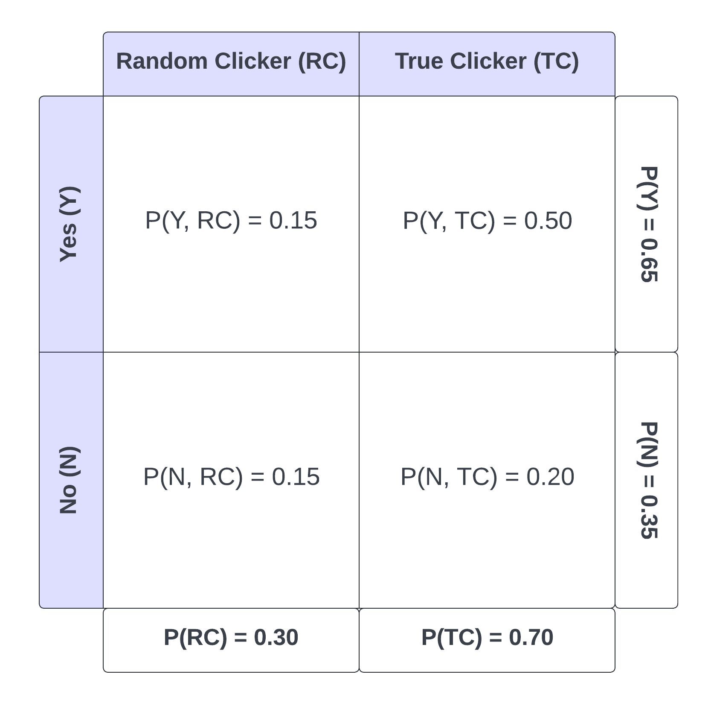 -

We’re looking for P(Y\|TC) so we can use the rule of total probability:

P(Y) = P(Y, TC) + P(Y, RC) = P(TC) \* P(Y\|TC) + P(RC) \* P(Y\|RC)

We know all of these inputs to the equation except for P(Y\|TC), so we
want to solve for that unknown.

0.65 = 0.7 \* P(Y\|TC) + 0.3 \* 0.5

From the above equation, we find that P(Y\|TC)

0.714286. This means that truthful clickers answer yes to the question
about 71.43% of the time.

### Part b.

P(Disease) = 0.000025 P(No Disease) = 0.999975 (1-0.000025)
P(Positive\|Disease) = .993 P(Negative\|No Disease) = 0.9999

The probabilities above are summarized in the tree diagram below:

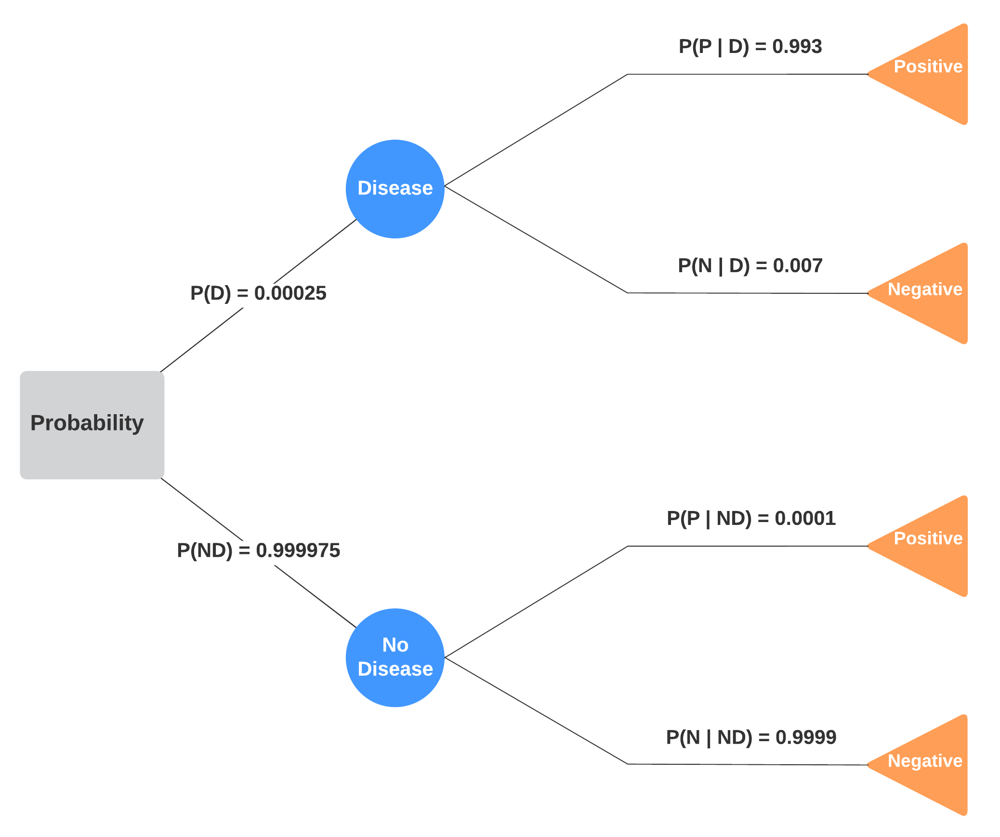

We’re looking for P(Disease\|Positive) so we can use Baye’s Law:

*P(Positive|Disease)}{P(Disease)*P(Positive|Disease)+P(No Disease)*P(Positive|No Disease)}")

We have almost all of the inputs that we need, however, we’re missing
P(Positive\|No Disease). These are false positives. We can find the
missing probability by taking 1 - true negatives, or 1 - 0.9999 to get
P(Positive\|No Disease) as 0.0001. Now we can solve for
P(Disease\|Positive).

.198882. Thus, if someone tests positive, they have about a 19.89%
chance of actually having the disease.

# Wrangling the Billboard Top 100

### Part a.

| performer                                 | song                                | count |
|:------------------------------------------|:------------------------------------|------:|
| Imagine Dragons                           | Radioactive                         |    87 |
| AWOLNATION                                | Sail                                |    79 |
| Jason Mraz                                | I’m Yours                           |    76 |
| The Weeknd                                | Blinding Lights                     |    76 |
| LeAnn Rimes                               | How Do I Live                       |    69 |
| LMFAO Featuring Lauren Bennett & GoonRock | Party Rock Anthem                   |    68 |
| OneRepublic                               | Counting Stars                      |    68 |
| Adele                                     | Rolling In The Deep                 |    65 |
| Jewel                                     | Foolish Games/You Were Meant For Me |    65 |
| Carrie Underwood                          | Before He Cheats                    |    64 |

The table above shows the top 10 longest lasting songs on the Billboard
100. It reveals that a majority of these long-lasting songs are more
recent songs.

### Part b.

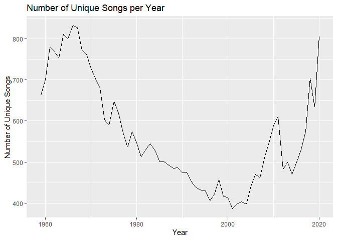<!-- -->

As seen in the plot, the number of unique songs steadily decreased from
roughly 1965 to a overall minimum of just below 400 songs around 2000.
Since then, the trend has been increasing and in the last year of data
(2020), there were about 800 unique songs. It looks like it’s on trend
to surpass its historical max in the mid 1960s (about 830).

### Part c.

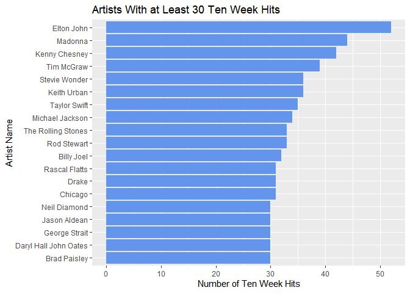<!-- -->

Given the bar plot above, it shows us that Elton John had the most 10
week hits with just over 50. The other 18 artists in the plot seem to be
a mix of generations and genres, but they all are relatively well known
which makes sense given that they have so many hits.

# Visual Story Telling Part 1: Green Buildings

To begin this problem, we can look at the distribution of rents for
green buildings vs. non-green buildings and we see that indeed green
buildings have a slightly higher median rent than non-green buildings.
We’re already skeptical of the stats guru, because while yes, there is a
difference in rents, it’s really not very significant.

*Figure 1*

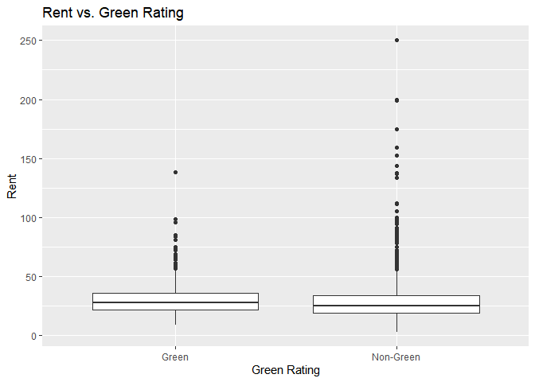<!-- -->

Even though the rent premium wasn’t that large, if the leasing rate in
green buildings was substantially higher, the larger volume of tenants
to charge rent to might still justify undergoing the investment.
However, the boxplot below suggests that there’s not a huge difference
in the median leasing rates between green and non-green buildings.

*Figure 2*

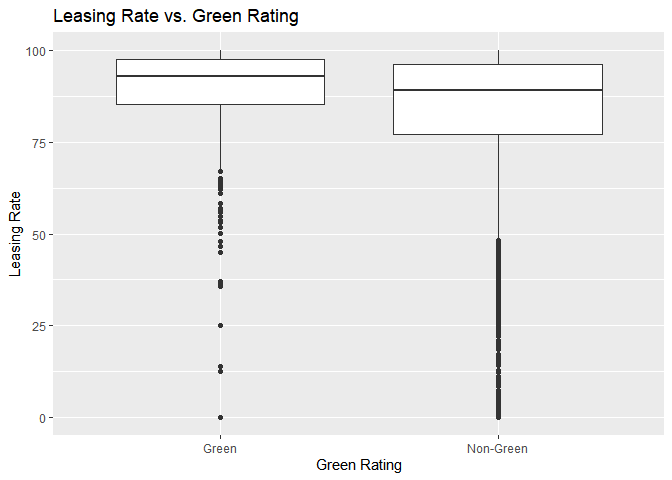<!-- -->

We also wanted to explore some confounding variables that may be
influencing the relationship between rent and green rating. The plot
below reveals that green buildings tend to be significantly newer
compared to non-green buildings. This could be a problem because perhaps
the premium of green buildings is just because they’re newer buildings.

*Figure 3*

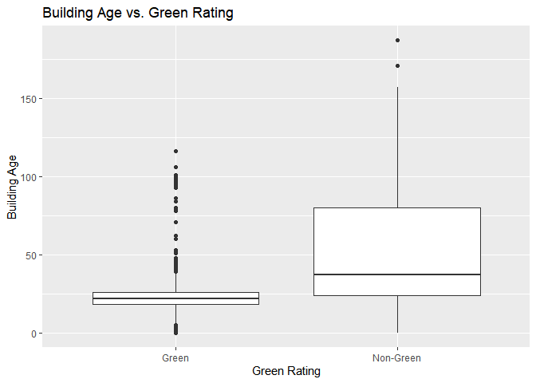<!-- -->

The plot below “adjusts” for age by plotting the 10 year rolling average
rent vs. age and then faceted by green vs. non-green buildings. It shows
that the average rents between green vs. non-green buildings doesn’t
appear to be significantly different in the range of 0-100 years of age.
Interestingly, we found that there are some very old (100-150 years)
non-green buildings that have very low 10 year rolling average rents
whereas there are no green buildings in this age range. It seems as
though the very old non-green buildings may be the reason for the median
rent discrepancy shown in Figure 1.

*Figure 4*

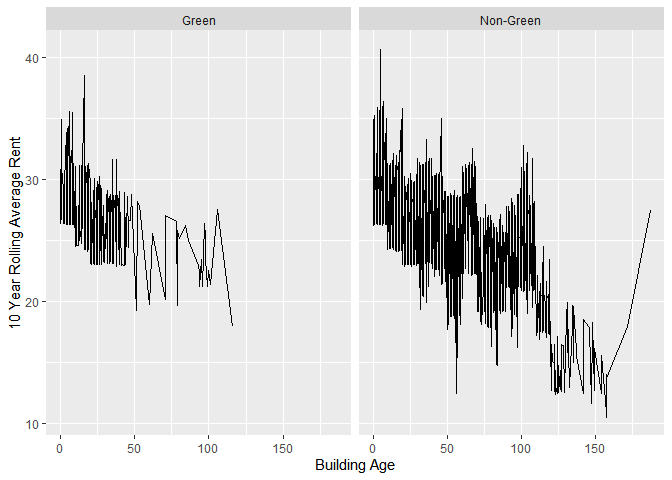<!-- -->

Another confounding variable that we noticed was building class. There
are many more buildings of class A (higher quality) than class B for
green buildings and the opposite for non-green. Thus, the rent
discrepancy in Figure 1 could just be because of quality differences.

*Figure 5*

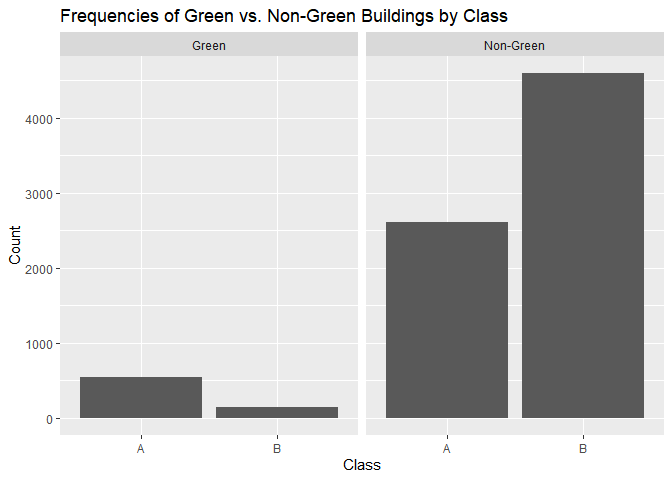<!-- -->

Figures 6 and 7 below “adjust” for class by having a pair of box plots
showing rent vs. green rating for class A buildings and then another set
of box plots for class B buildings. After controlling for building
class, in both plots the median rent for green and non-green buildings
were not significantly different.

*Figure 6*

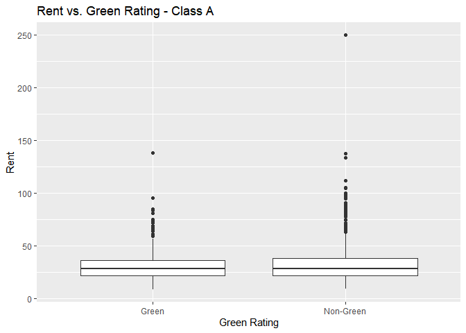<!-- -->

*Figure 7*

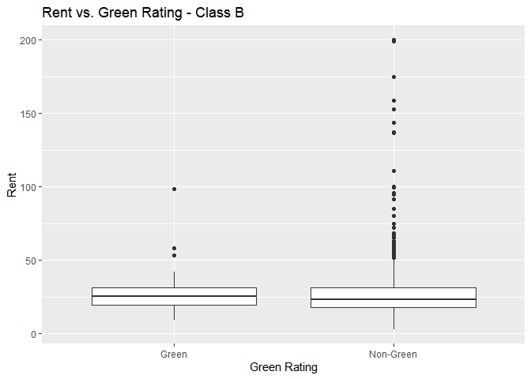<!-- -->

Overall, there doesn’t seem to be a significant difference in median
rents between green and non-green buildings which was true even after
controlling for building age and building class. If we were to get a
different sample of green vs. non-green buildings, it’s possible that
the median rent for green buildings could be lower than non-green
buildings because the medians in our sample were so close. Ultimately,
it doesn’t seem to be wise to undergo additional costs to make the
building green when there doesn’t appear to be a significantly higher
median rent that can be charged to offset the cost. The analyst failed
to consider the sample variability, confounding variables, or the time
value of money (i.e. $650,000 9 years from now isn’t same as $650,000
today).

# Visual Story Telling Part 2: Cap Metro Data

To begin, we analyzed the total volume of ridership (Boarding and
Alighting) across three distinct periods of the day (Morning, Afternoon,
and Evening) on both weekdays and weekends. We noticed that on weekdays,
Morning and Afternoon were by far the most active times. Meanwhile, on
weekends, afternoon was the most popular time followed by evening.
However, the total volume of ridership was much lower on weekends as
expected since people are using the Metro for leisure rather than
commuting.

*Figure 1*

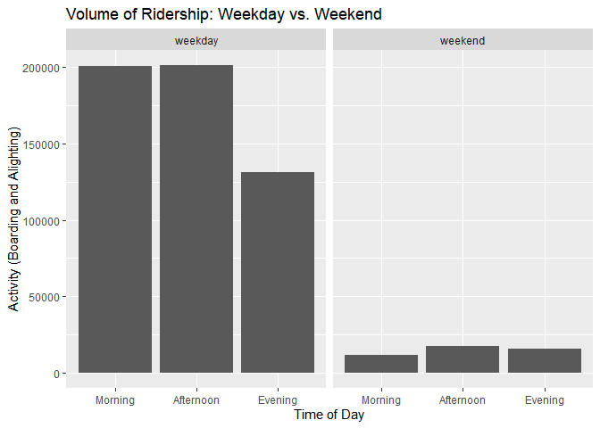<!-- -->

Following our analysis above, we decided to hone in on a specific
weekday (Wednesday) and a specific weekend day (Sunday) to get a better
understanding of the hourly trends of net ridership. What we discovered
was net ridership was most negative (i.e. more people getting off the
bus) in the morning hours of 8-9am. From here, average net ridership
increases and becomes positive at around noon. It reaches its max
between 4-5pm (more people getting on bus to go home).

*Figure 2*

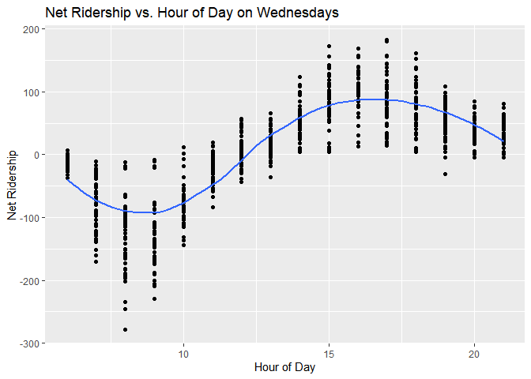<!-- -->

On Sundays, the trend of average net ridership is much flatter and less
volatile. It appears to reach a minimum at noon, hits 0 at 3pm, and
reaches its max at around 5-6. Since people aren’t typically commuting
to work/school on Sundays, net ridership doesn’t show nearly as clear of
a pattern compared to Wednesday.

*Figure 3*

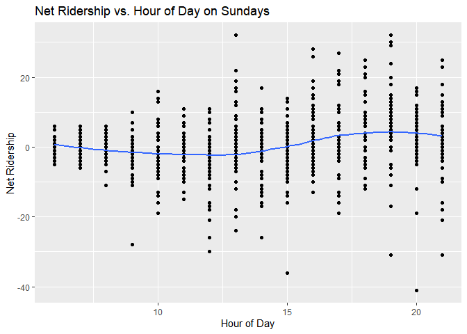<!-- -->

After looking at Figures 1-3, it’s clear that afternoons are the most
popular boarding time for both weekdays and weekends (positive net
ridership). We wanted to see specifically for afternoons, what impact
temperature had on curbing or enhancing Metro ridership.

*Figure 4*

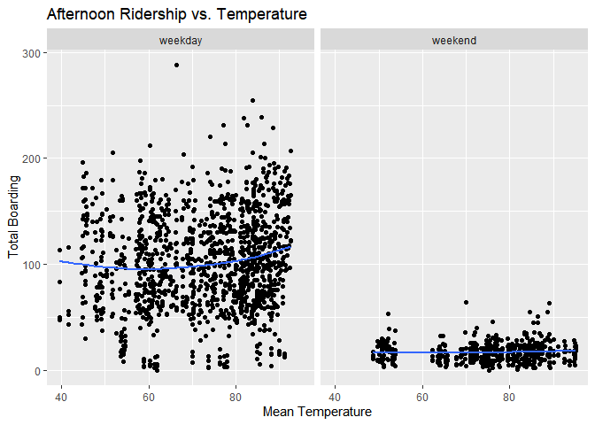<!-- -->

The boarding trend is pretty flat on weekends, but shows an upward curve
for more extreme temperatures on weekdays. The heightened sensitivity to
temperature on weekday ridership is likely due to people opting for a
temperature-controlled bus ride rather than being outdoors. It’s also
possible that the increased boarding for higher temperatures corresponds
to the peak boarding times on weekdays of 3-4pm which also happens to be
the hottest part of the day generally.

# Clustering and PCA

To start this analysis, we created 5 principal components based on the
11 chemical properties in the data set. To see how well our principal
components captured variability in our data set, we made the scree plot
below to see the percentage variance explained by each principal
component. We see that principal components 1 and 2 both explain more
than 20% of the variance which suggests that they’re worth looking into
further.

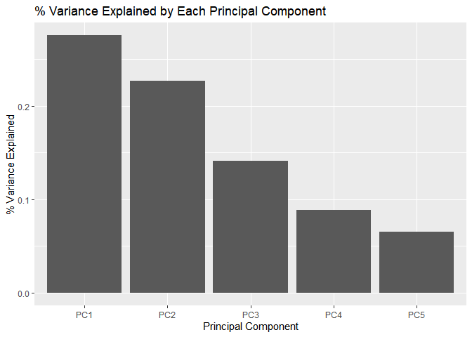<!-- -->

To understand what the first principal component is capturing, we looked
at its correlations with other variables in the data set. We see that
this principal component has strong positive correlations with:
total.sulfur.dioxide, free.sulfur.dioxide, and residual sugar. It also
has strong negative correlations with: volatile.acidity, sulfates, and
chlorides. If we knew more about wine chemistry, this would probably
become more meaningful to us.

*Figure 1*

| Variable             | Correlation with PC1 |
|:---------------------|---------------------:|
| fixed.acidity        |           -0.4156657 |
| volatile.acidity     |           -0.6627662 |
| citric.acid          |            0.2652552 |
| residual.sugar       |            0.6021261 |
| chlorides            |           -0.5049850 |
| free.sulfur.dioxide  |            0.7500712 |
| total.sulfur.dioxide |            0.8484251 |
| density              |           -0.0782190 |
| pH                   |           -0.3806569 |
| sulphates            |           -0.5119869 |
| alcohol              |           -0.1852700 |

We plotted the wine color against the scores of the first principal
component to see whether this principal component was useful in
separating between red and white wines. Given the differences in the box
plots’ medians, the first principal component is useful in determining
color.

*Figure 2*

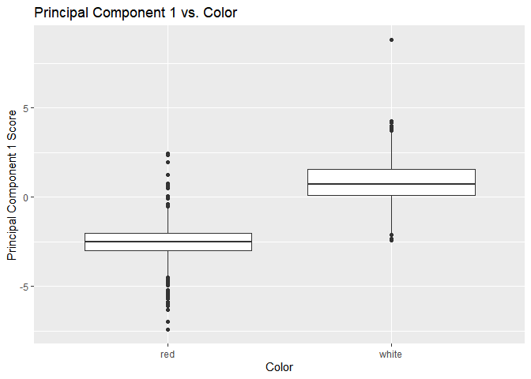<!-- -->

We also checked if principal component 1 was good at distinguishing
between wine qualities. Judging from the wide variation in principal
component 1 scores for each level of quality, this does appear to be the
case.

*Figure 3*

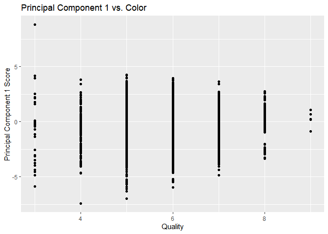<!-- -->

To dive deeper into the meaning of the second principal component, we
again looked at its correlations with other variables in the data set.
We see that this principal component has strong positive correlations
with: density, fixed.acidity, and residual.sugar. It also has strong
negative correlations with alcohol. Yet again, having more domain
knowledge about wine would be helpful here.

*Figure 4*

| Variable             | Correlation with PC2 |
|:---------------------|---------------------:|
| fixed.acidity        |            0.5311661 |
| volatile.acidity     |            0.1856328 |
| citric.acid          |            0.2894637 |
| residual.sugar       |            0.5209956 |
| chlorides            |            0.4978508 |
| free.sulfur.dioxide  |            0.1135949 |
| total.sulfur.dioxide |            0.1378096 |
| density              |            0.9223031 |
| pH                   |           -0.2461460 |
| sulphates            |            0.3027547 |
| alcohol              |           -0.7344122 |

Next, we examined whether principal component 2 was helpful to
distinguish wine color as well as wine quality. It really wasn’t too
useful in labeling color or quality as shown in the plots below. There
was a slight negative trend in Figure 6, but it wasn’t very significant.
We also tried principal components 3-5 (not shown in plots) and received
similar results.

*Figure 5*

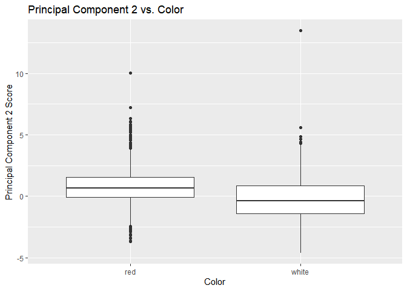<!-- -->

*Figure 6*

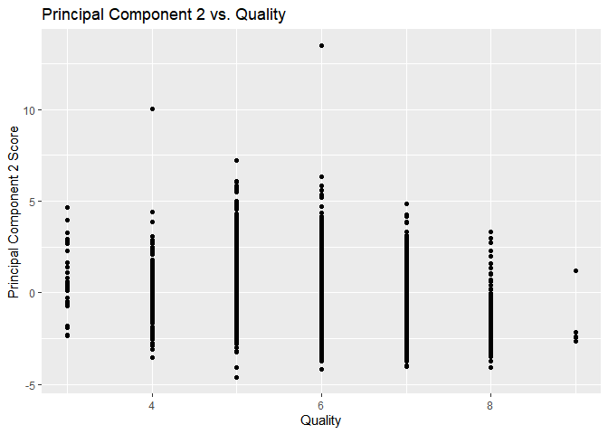<!-- -->

After thoroughly exploring PCA, we decided to move on to clustering. We
used k-means clustering to create 2 clusters (hopefully one for red
wines, and one for white). Our results were promising as Cluster 1 is
mostly red wines, whereas Cluster 2 is mostly white wines. Even just
making two clusters distinguishes between the two wine colors very well
(98.58% of wines were grouped correctly).

*Figure 7*

|           |  red | white |
|:----------|-----:|------:|
| Cluster 1 | 1575 |    68 |
| Cluster 2 |   24 |  4830 |

While the 2 clusters separated out the two wine colors well, they don’t
seem to distinguish between wine quality because the median quality is
essentially the same for both clusters. Even if we increase the number
of clusters pretty dramatically up to 10, there still doesn’t appear to
be major quality differences between the box plots.

*Figure 8*

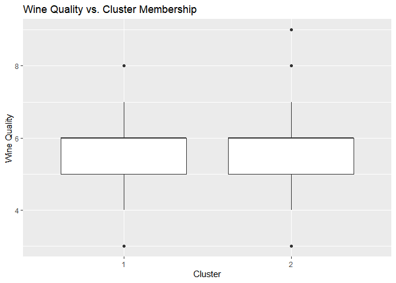<!-- -->

Overall, both PCA and k-means clustering could pretty easily distinguish
red and white wines as shown in Figure 2 and Figure 7. Both methods
weren’t as good at determining the wine’s quality. We think that k-means
clustering is better primarily for ease of interpretation as it gives us
one cluster label for each wine as opposed to multiple different
principal components to try to then interpret their meaning.

# Portfolio Modeling

For our portfolio we selected five ETF’s.

-   ARKK (ARK Innovation) is a fund that invests in companies that are
    involved in the development of new technologies. (RISKY)
-   QQQ (Invesco QQQ Trust) is a ETF with primarily US tech companies.
    (RISKY)
-   IWM (iShares Russell 2000 ETF) is a ETF with primarily US small cap
    companies. (MODERATELY RISKY)
-   SPY (SPDR S&P 500 ETF Trust) is a ETF with primarily US large cap
    companies. (MODERATELY RISKY)
-   GLD (SPDR Gold Trust) is a ETF with primarily gold. (SAFE)

We tried to make three portfolios:

1.  Higher weights in risky ETFs (0.4 ARKK, 0.2 QQQ, 0.15 IWM, 0.15 SPY,
    0.1 GLD)
2.  Equally weighted in all ETFs (0.2 ARKK, 0.2 QQQ, 0.2 IWM, 0.2 SPY,
    0.2 GLD)
3.  Lower weights in risky ETFs (0.1 ARKK, 0.2 QQQ, 0.2 IWM, 0.2 SPY,
    0.3 GLD)

Theoretically, portfolio (1) should have the highest VAR (value at
risk), followed by (2) and (3). For our simulations, we used 5000
iterations for each portfolio and daily data from 2017-2022. We
performed daily rebalancing in all simulations and have reported our
VARs at the 95% confidence interval.

Results:
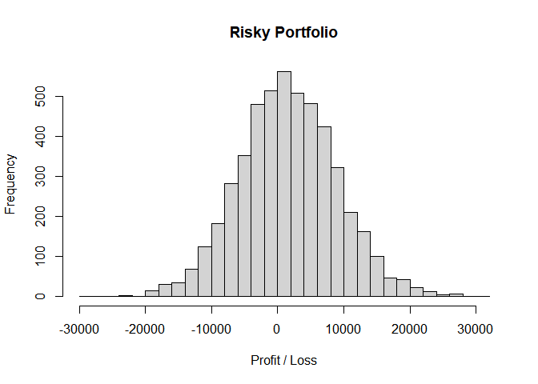<!-- -->

    ## [1] "The value at risk for 4-weeks of the risky portfolio is  -10374.86 USD ( -10.37 %)"

    ## [1] "The mean return for 4-weeks of the risky portfolio is  1.6022 %"

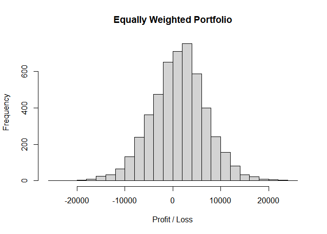<!-- -->

    ## [1] "The value at risk for 4-weeks of the equally weighted portfolio is  -8211.49 USD ( -8.21 %)"

    ## [1] "The mean return for 4-weeks of the equally weighted portfolio is  1.2601 %"

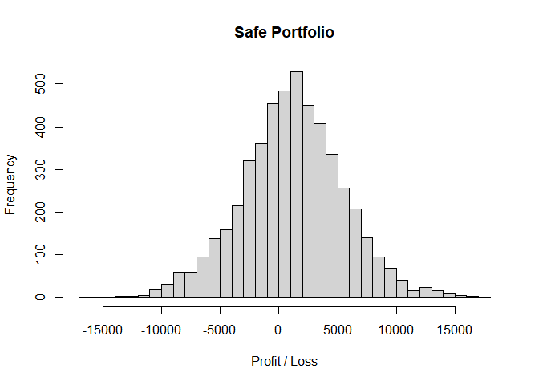<!-- -->

    ## [1] "The value at risk for 4-weeks of the safe portfolio is  -6178.11 USD ( -6.18 %)"

    ## [1] "The mean return for 4-weeks of the safe portfolio is  1.1514 %"

**Report**

After completing bootstrap re-sampling to estimate the 4-week (20
trading day) value at risk of each of the three portfolios of ETFs at
the 5% level, it was discovered that the results were in line with
financial theory. As expected, the Risky Portfolio has the highest value
at risk of 10.37%, followed by the Equally Weighted portfolio at 8.21%.
Additionally, the Safe Portfolio has the lowest value at risk at 6.18%.
We expected the portfolios with the highest VARs to have the highest
returns as well (Risk-Return trade off). Analyzing the returns, we see
that this in fact does hold true in our simulations with the 4-week mean
returns being 1.6022%, 1.2601%, and 1.1514% for the Risky Portfolio,
Equally Weighted Portfolio, and the Safe Portfolio, respectively.

# Market Segmentation

We started our analysis by looking at total counts of tweets per each
tweet category. Among the top tweet categories, there appears to be a
recurring theme regarding general health and wellness (health-nutrition,
cooking, travel, personal fitness, and food). Given this result, we
assumed that NutrientH20 is a “health and wellness” company. This
directed our cluster analysis below to enhance NutrientH20’s online
advertising campaign strategy.

*Figure 1*

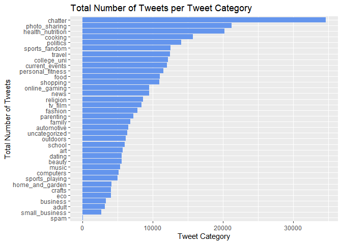<!-- -->

We decided to define market segments for this problem as clusters
identified through the k-means clustering approach. We omitted the
Twitter user’s randomly generated ID when creating the clusters and
instead only used the scores for each tweet interest area. We settled on
creating 10 market segments (clusters) as 10 seemed to be a sweet spot
between capturing legitimate differences between Twitter followers while
also not overloading the company with too many market segments to try to
understand.

While NutrientH20 might be interested in all 10 of the market segments
that we’ve identified, they’ll likely care the most about the segments
that would be most receptive to their products. Thus, we found the 3
market segments with the highest average scores for the
“health_nutrition” interest given that NutrientH20 seems to be a
health-oriented company. The summaries of the three segments are below:

*Figure 2*

| Market Segment | Interest Category | Average Score |
|---------------:|:------------------|--------------:|
|              1 | health_nutrition  |     12.541667 |
|              1 | personal_fitness  |      6.651042 |
|              1 | chatter           |      3.941406 |
|              1 | cooking           |      3.425781 |
|              1 | outdoors          |      2.876302 |
|              1 | photo_sharing     |      2.399740 |
|              1 | food              |      2.205729 |
|              1 | current_events    |      1.514323 |
|              1 | shopping          |      1.283854 |
|              1 | travel            |      1.229167 |

*Figure 3*

|     | Market Segment | Interest Category | Average Score |
|:----|---------------:|:------------------|--------------:|
| 11  |              3 | cooking           |     11.684211 |
| 12  |              3 | photo_sharing     |      6.088421 |
| 13  |              3 | fashion           |      5.985263 |
| 14  |              3 | chatter           |      4.246316 |
| 15  |              3 | beauty            |      4.208421 |
| 16  |              3 | health_nutrition  |      2.269474 |
| 17  |              3 | shopping          |      1.755789 |
| 18  |              3 | current_events    |      1.751579 |
| 19  |              3 | college_uni       |      1.496842 |
| 20  |              3 | travel            |      1.461053 |

*Figure 4*

|     | Market Segment | Interest Category | Average Score |
|:----|---------------:|:------------------|--------------:|
| 21  |              4 | chatter           |      4.653061 |
| 22  |              4 | health_nutrition  |      2.795918 |
| 23  |              4 | photo_sharing     |      2.448980 |
| 24  |              4 | travel            |      2.244898 |
| 25  |              4 | politics          |      2.244898 |
| 26  |              4 | college_uni       |      1.918367 |
| 27  |              4 | sports_fandom     |      1.897959 |
| 28  |              4 | current_events    |      1.877551 |
| 29  |              4 | cooking           |      1.795918 |
| 30  |              4 | personal_fitness  |      1.755102 |

From the three most promising market segments (highest scores for
“health-nutrition”), the first one appears to be the most appealing to
NutrientH20. Members of this segment have by far the highest average
scores for the “health_nutrition” interest category, and also have high
average scores for “fitness” which probably is something closely related
to what NutrientH20 does as well. There are 768 Twitter users in the
most promising market segment of segment 1, and then 475 and 49 in
segments 3 and 4, respectively. Focusing in on these market segments
will hopefully yield more future customers than trying to market to all
Twitter followers.

*Figure 5*

| Cluster | Number of Twitter Users |
|:--------|------------------------:|
| 1       |                     768 |
| 2       |                     429 |
| 3       |                     475 |
| 4       |                      49 |
| 5       |                     350 |
| 6       |                    1065 |
| 7       |                     412 |
| 8       |                    3311 |
| 9       |                     349 |
| 10      |                     674 |

# The Reuters Corpus

### Question

Reuters is a London based news agency providing business, financial,
national, and international news to professionals. They employ a broad
range of writers who publish about their specific areas of expertise. We
want to identify and uncover the relationships between the topics
covered by Reuters and any topic-related blind spots and deficiencies
that may be exploited to increase revenue in the future.

### Approach

To visualize the relationships between the topics, we wanted to leverage
associate rule mining. To achieve this we did the following:  For
each author, we read in all fifty documents. The documents for each
author are then concatenated into a list. This list is then tokenized so
that we can remove the stop words and get frequency counts for the words
in the list. We then use the frequency counts to find the top 25 words
used by each author. Using these frequency counts, we make a data frame
of all these words in the format (author, word) and use it for associate
rule mining. The associate rule mining code is similar to the example
demonstrated in class. We used Gephi to organize and visualize the nodes
and edges of the network obtained.

### Results

The results of the associate rule mining are shown in the image below.

#### Full Network

Below is the full network. The nodes are the topics (most frequently
used words) and edges are frequencies of them appearing together in our
data set. The coloring is associated with specific clusters to highlight
the inter connectivity of the topics. In the next few sections, we will
dive deeper into some of the specifics of the clusters to identify which
topics Reuters is reporting on most frequently. There are three main
clusters we identified: the stock market, the United States, and China.
The stock market cluster (market) is the widest we identified spanning
the entire network. The United States cluster is on the bottom left of
the network. Finally, the densest cluster in the bottom right of the
network represents topics related to Chinese politics and Chinese
international affairs.

\-

*Figure 1* 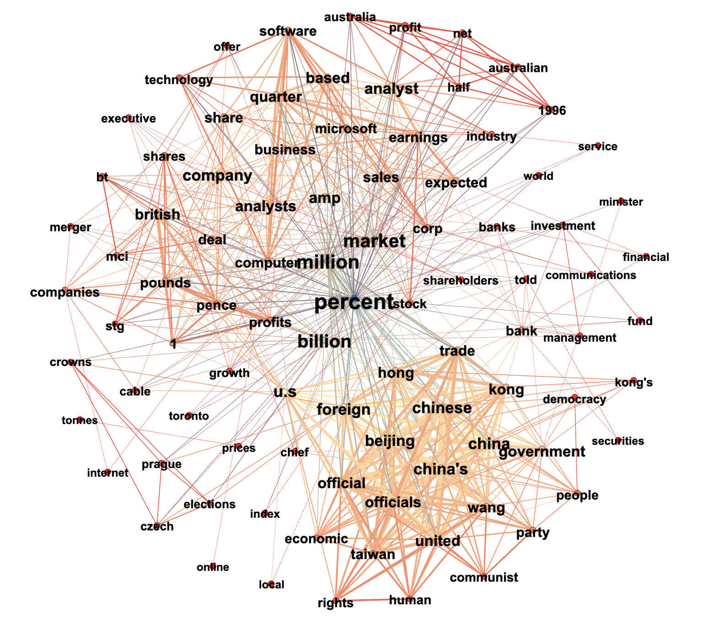

#### Stock Market Cluster

The largest cluster out of the main three we identified was the market.
The word market is a reference by Reuters authors to the general global
equity market, with nodes spanning from analysis and business
recommendations to the impact of foreign affairs on global market
conditions. We can clearly see the intersection of Reuters’ main
objective, to provide business, financial, national, and international
news to professionals, as shown in this cluster.

\-

*Figure 2* 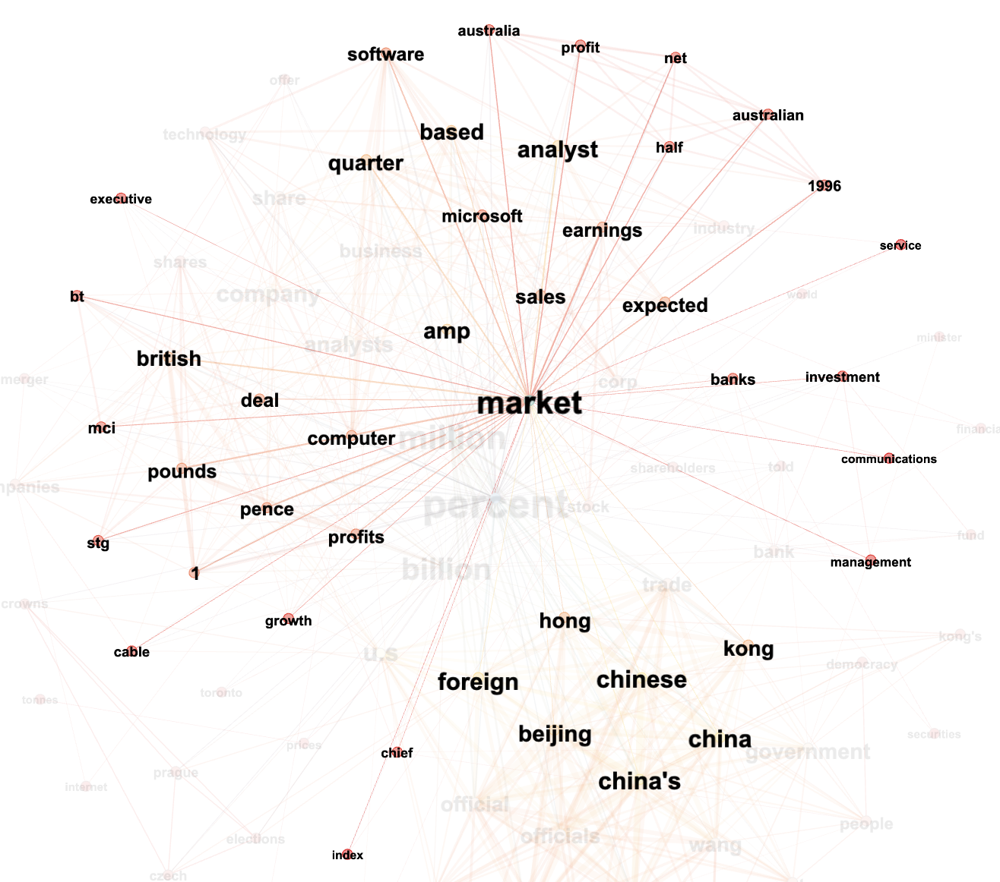

#### United States Cluster

The next cluster is related to foreign affairs associated with the
United States of America. The authors only reference the United States
when interpreting its influence on Chinese and British politics. This is
unique as there is no mention of U.S. domestic news. Also, there is no
relationship between the United States and the global market cluster.

\-

*Figure 3* 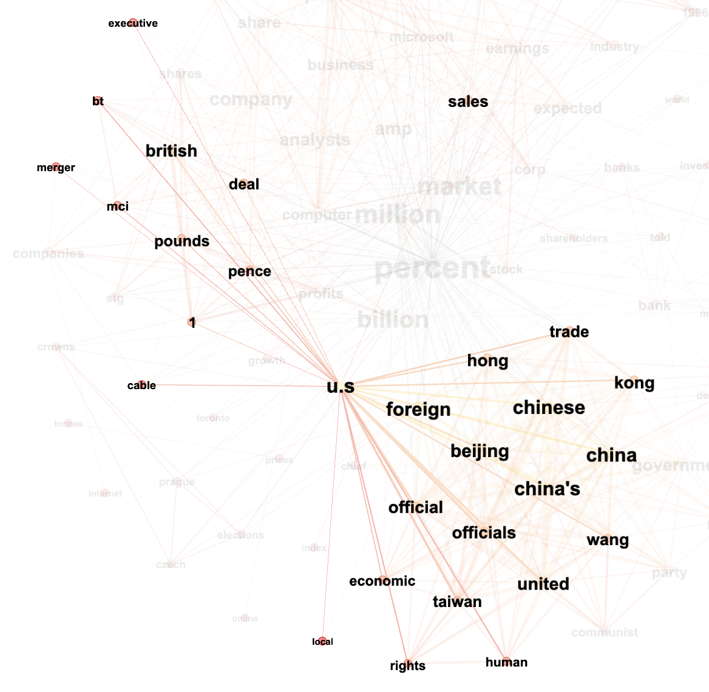

#### China Cluster

The China cluster is the densest of the main three we identified. The
topics mentioned in the cluster relate mostly to communism, human
rights, democracy, and Hong Kong. This implies that Chinese politics is
very heavily covered by Reuters. The authors at Reuters also related
Chinese domestic affairs to global market conditions and it’s clear from
the weights of the edges that topics related to China were the most
influential topics in Reuters articles. China’s yearly exports of 3.5
trillion dollars and gross domestic product (GDP) of nearly fifteen
trillion dollars helps explain why China is so influential in the global
news and overall market.

\-

*Figure 4* 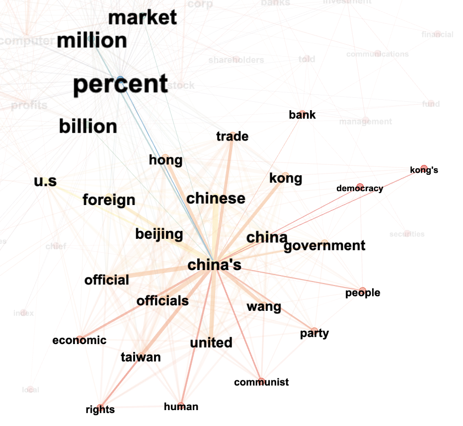

### Conclusion

In conclusion, Reuters does a good job of covering global news, with a
heavy focus on Chinese politics. After reviewing the United States
cluster, we were able to identity an area where Reuters could increase
stakeholder value by reporting more frequently on United States domestic
politics and market conditions. The United States equity market is 40.9%
of the global equity market capitalization ($118 Trillion) or nearly
forty-four trillion dollars. With a global equity market influence four
times larger than China, the current domestic and foreign affairs within
the United States should be talked about as much if not more than the
Chinese economic climate. Another blind spot that Reuters could leverage
to increase stakeholder returns is increasing the frequency in which
they talk about oil, gas, and energy sectors. Many analysts claim the
energy sector is the most important sector in the world responsible for
determining the current global trade climate and establishing
relationships between countries. Due to these factors, there is a large
demographic of individuals that would likely consume information about
the current conditions of the energy sector. This is another potentially
untapped audience that would subscribe to Reuters if energy sector news
was as prevalent as other market sectors, such as technology and
financials (both shown in the network). By simply increasing the amount
of articles associated with the current United States financial and
political climates and improving coverage of the overall global energy
sector, Reuters could potentially increase their audience improving
stakeholder returns.

# Association Rule Mining

We decided to make a set of association rules for the groceries data
that had a support of at least 0.005, a confidence of at least 0.4, and
a maximum length of 4. We felt as though rules conforming to these
thresholds were reasonably common enough (in 0.5% of all baskets) to not
just be flukes and had high enough conditional probabilities to
potentially be actionable. We also capped the maximum length to be 4 to
avoid any long chains of items in our association rules that would lack
interpretability.

Once these association rules were developed, we wanted to visualize the
top 10 rules in terms of lift. What’s immediately apparent in the plot
below is there are three right hand side items: tropical fruit, root
vegetables, and yogurt. Among these three items, root vegetables have
6/10 of the top 10 rules. This isn’t all that helpful as these 6 rules
could help us sell more root vegetables, but it also could be the case
that lots of people buy root vegetables in general which is why it
appears in so many of these top lift rules. Additionally, the maximum
lift was only about 4.08 which isn’t very large especially compared to
our playlist analysis in class.

*Figure 1*

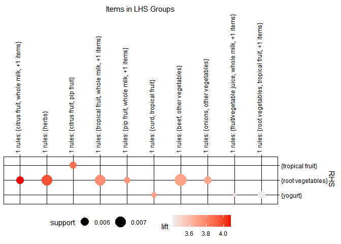<!-- -->

To check the overall popularity of the three right hand side items
above, we created the plot below of the top 10 items across all of our
association rules. Whole milk (80%) and other vegetables (45%) are the
most common items in our association rules as shown by the bars. The red
line shows the overall frequency of the items across all shopping
baskets. The three right hand side items from above (tropical fruit,
root vegetables, and yogurt) all appeared slightly more frequently in
our association rules than they did in overall market basket
transactions. This plot also reveals that outside of the top 10 lift
association rules, whole milk dominates the association rules as it
appears in more than 80% of them.

*Figure 2* - **Relative Frequency of Top 10 Items in Association Rules**

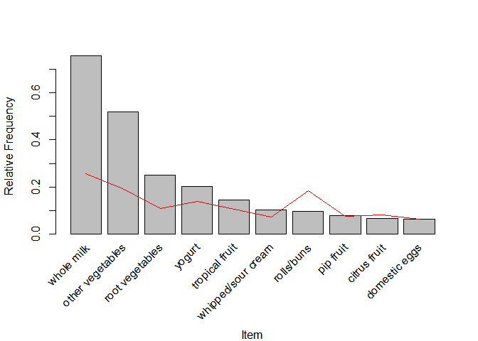<!-- -->

After some further analysis, we found that whole milk appears on the
right in about

63% of these association rules. This is likely because of milk’s
relatively high prevalence in all market baskets. Furthermore, more
accurately predicting who will buy milk isn’t all that useful given that
milk is a low cost staple item unlikely to greatly enhance a store’s
revenue with higher sales.

The last step of our analysis was to import this data into Gephi to try
and visualize any patterns between items that we missed via the plots
above.

In the figure below, we created a network plot that visualizes the
relationships between the various items in our association rules with
items with a higher degree (i.e. more connections) in larger font. We
also used the modularity feature to group the items into two groups,
although the groups themselves aren’t that interesting. It seems as
though the red group is items that are associated with milk, and the
green group is items that are associated with other vegetables. We saw
in Figure 2 that whole milk and other vegetables appeared the most
frequently in our association rules and unsurprisingly, we find them at
the center of this network plot in the largest font.

*Figure 3* - **Network Plot of Association Rules Colored by Modularity**

\-

\-

We then decided to look more in depth at yogurt because it was one of
the top right hand side items in Figure 1. We felt like the connections
in Figure 4 below for yogurt made sense which validated our network
plot. Yogurt appears in association rules alongside other dairy products
such as: whipped/sour cream, cream cheese, and curds. This seems logical
since these items are likely placed in the same area so shoppers are
tempted to buy them together in greater frequencies. Furthermore, yogurt
also appeared in association rules with whole milk and produce because
these were very commonly bought items overall.

*Figure 4* - **Network Plot Connections of Yogurt**

\-

